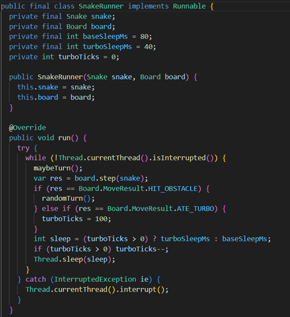
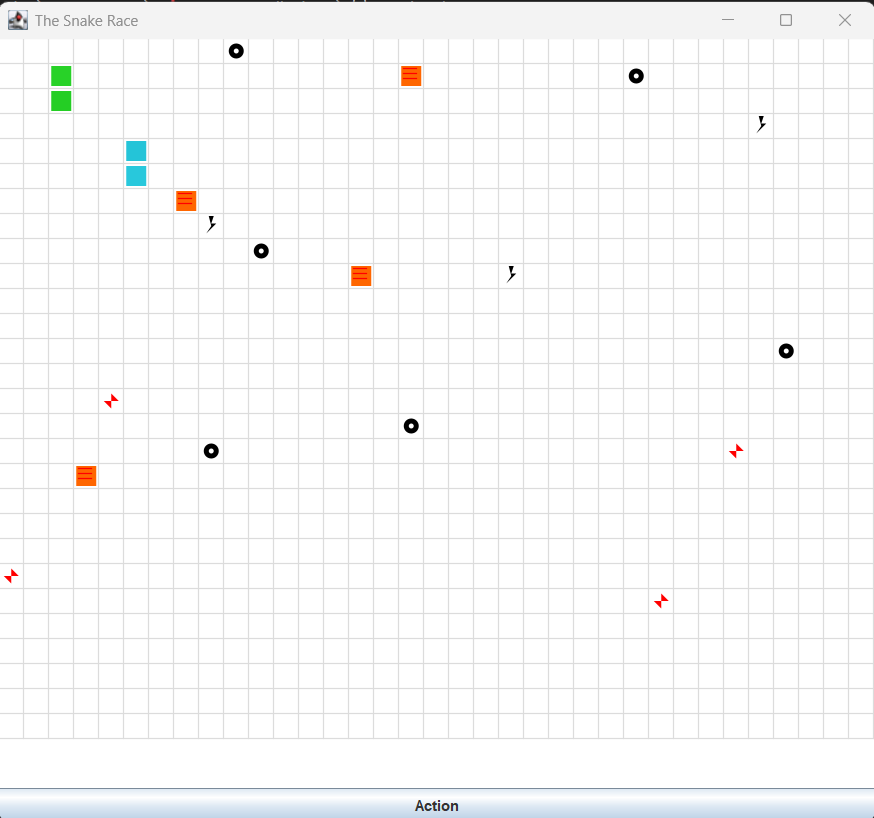
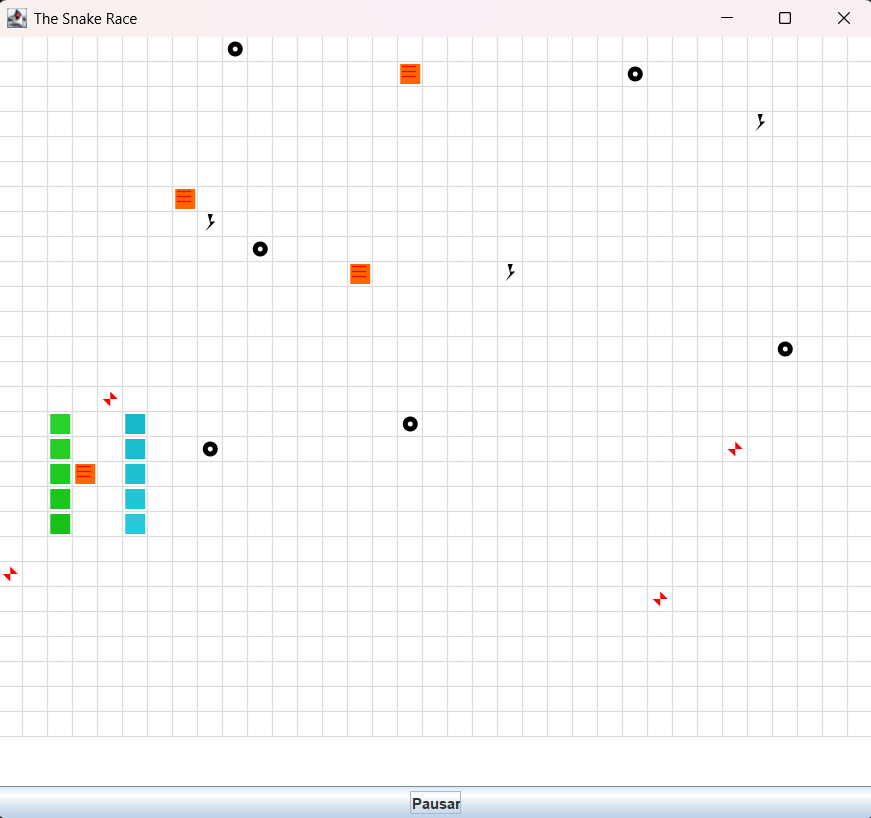
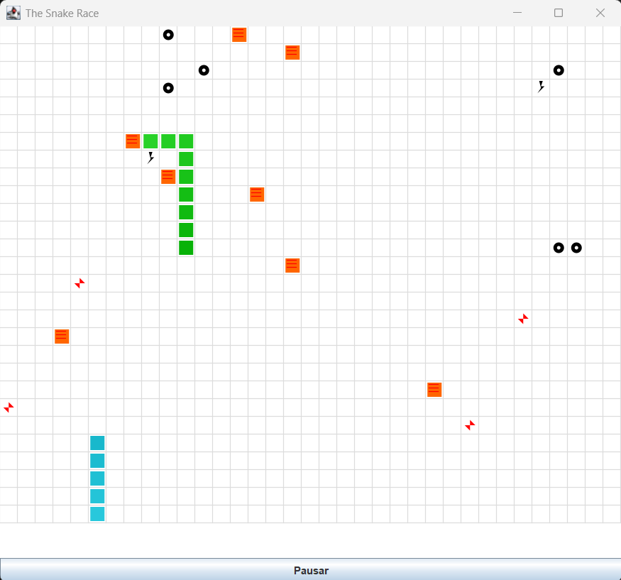
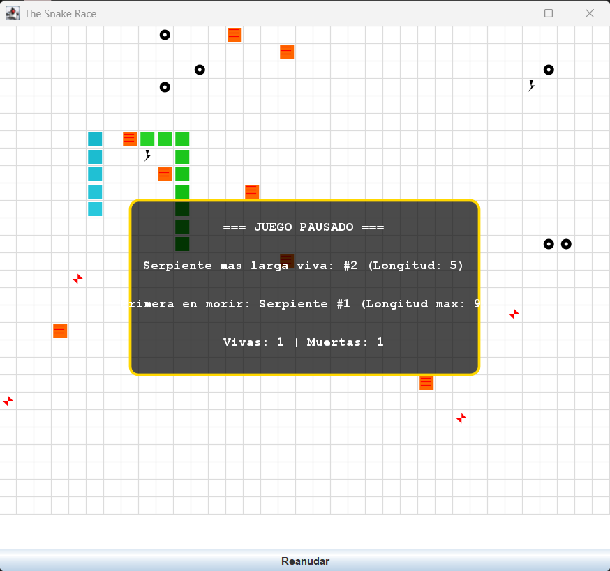
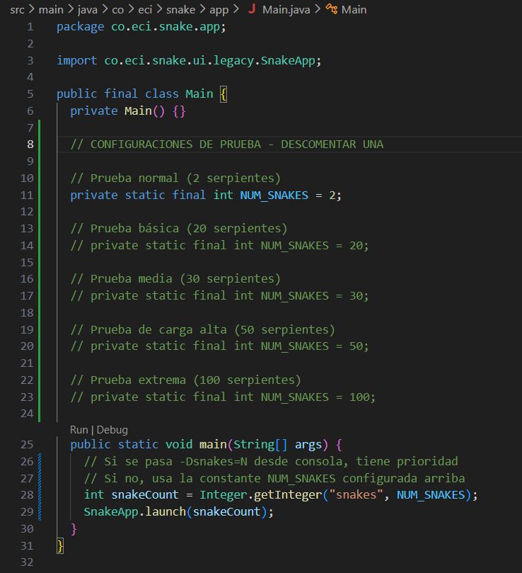

# Snake Race — ARSW Lab #2 (Java 21, Virtual Threads)

**Escuela Colombiana de Ingeniería – Arquitecturas de Software**  
Laboratorio de programación concurrente: condiciones de carrera, sincronización y colecciones seguras.  

**Integrantes**  
- Laura Alejandra Venegas Piraban
- Sergio Alejandro Idarraga Torres  
---

## Requisitos

- **JDK 21** (Temurin recomendado)
- **Maven 3.9+**
- SO: Windows, macOS o Linux

---

## Cómo ejecutar

```bash
mvn clean verify
mvn -q -DskipTests exec:java -Dsnakes=4
```

- `-Dsnakes=N` → inicia el juego con **N** serpientes (por defecto 2).
- **Controles**:
  - **Flechas**: serpiente **0** (Jugador 1).
  - **WASD**: serpiente **1** (si existe).
  - **Espacio** o botón **Action**: Pausar / Reanudar.

---

## Reglas del juego (resumen)

- **N serpientes** corren de forma autónoma (cada una en su propio hilo).
- **Ratones**: al comer uno, la serpiente **crece** y aparece un **nuevo obstáculo**.
- **Obstáculos**: si la cabeza entra en un obstáculo hay **rebote**.
- **Teletransportadores** (flechas rojas): entrar por uno te **saca por su par**.
- **Rayos (Turbo)**: al pisarlos, la serpiente obtiene **velocidad aumentada** temporal.
- Movimiento con **wrap-around** (el tablero “se repite” en los bordes).

---

## Arquitectura (carpetas)

```
co.eci.snake
├─ app/                 # Bootstrap de la aplicación (Main)
├─ core/                # Dominio: Board, Snake, Direction, Position
├─ core/engine/         # GameClock (ticks, Pausa/Reanudar)
├─ concurrency/         # SnakeRunner (lógica por serpiente con virtual threads)
└─ ui/legacy/           # UI estilo legado (Swing) con grilla y botón Action
```

---

# Actividades del laboratorio

## Parte I — (Calentamiento) `wait/notify` en un programa multi-hilo  

**NOTA**: El repositorio donde se trabaja PrimeFinder es: https://github.com/LauraVenegas6/wait-notify-excercise.git.

1. Toma el programa [**PrimeFinder**](https://github.com/ARSW-ECI/wait-notify-excercise).
2. Modifícalo para que **cada _t_ milisegundos**:
   - Se **pausen** todos los hilos trabajadores.
   - Se **muestre** cuántos números primos se han encontrado.
   - El programa **espere ENTER** para **reanudar**.
3. La sincronización debe usar **`synchronized`**, **`wait()`**, **`notify()` / `notifyAll()`** sobre el **mismo monitor** (sin _busy-waiting_).
4. Entrega en el reporte de laboratorio **las observaciones y/o comentarios** explicando tu diseño de sincronización (qué lock, qué condición, cómo evitas _lost wakeups_).

> Objetivo didáctico: practicar suspensión/continuación **sin** espera activa y consolidar el modelo de monitores en Java.  


---

## Parte II — SnakeRace concurrente (núcleo del laboratorio)

### 1) Análisis de concurrencia

- Explica **cómo** el código usa hilos para dar autonomía a cada serpiente.
- **Identifica** y documenta en **`el reporte de laboratorio`**:
  - Posibles **condiciones de carrera**.
  - **Colecciones** o estructuras **no seguras** en contexto concurrente.
  - Ocurrencias de **espera activa** (busy-wait) o de sincronización innecesaria.

### 2) Correcciones mínimas y regiones críticas

- **Elimina** esperas activas reemplazándolas por **señales** / **estados** o mecanismos de la librería de concurrencia.
- Protege **solo** las **regiones críticas estrictamente necesarias** (evita bloqueos amplios).
- Justifica en **`el reporte de laboratorio`** cada cambio: cuál era el riesgo y cómo lo resuelves.

### 3) Control de ejecución seguro (UI)

- Implementa la **UI** con **Iniciar / Pausar / Reanudar** (ya existe el botón _Action_ y el reloj `GameClock`).
- Al **Pausar**, muestra de forma **consistente** (sin _tearing_):
  - La **serpiente viva más larga**.
  - La **peor serpiente** (la que **primero murió**).
- Considera que la suspensión **no es instantánea**; coordina para que el estado mostrado no quede “a medias”.

### 4) Robustez bajo carga

- Ejecuta con **N alto** (`-Dsnakes=20` o más) y/o aumenta la velocidad.
- El juego **no debe romperse**: sin `ConcurrentModificationException`, sin lecturas inconsistentes, sin _deadlocks_.
- Si habilitas **teleports** y **turbo**, verifica que las reglas no introduzcan carreras.

> Entregables detallados más abajo.

---

## Entregables

1. **Código fuente** funcionando en **Java 21**.
2. Todo de manera clara en **`**el reporte de laboratorio**`** con:
   - Data races encontradas y su solución.
   - Colecciones mal usadas y cómo se protegieron (o sustituyeron).
   - Esperas activas eliminadas y mecanismo utilizado.
   - Regiones críticas definidas y justificación de su **alcance mínimo**.
3. UI con **Iniciar / Pausar / Reanudar** y estadísticas solicitadas al pausar.

---

## Criterios de evaluación (10)

- (3) **Concurrencia correcta**: sin data races; sincronización bien localizada.
- (2) **Pausa/Reanudar**: consistencia visual y de estado.
- (2) **Robustez**: corre **con N alto** y sin excepciones de concurrencia.
- (1.5) **Calidad**: estructura clara, nombres, comentarios; sin _code smells_ obvios.
- (1.5) **Documentación**: **`reporte de laboratorio`** claro, reproducible;

---

## Tips y configuración útil

- **Número de serpientes**: `-Dsnakes=N` al ejecutar.
- **Tamaño del tablero**: cambiar el constructor `new Board(width, height)`.
- **Teleports / Turbo**: editar `Board.java` (métodos de inicialización y reglas en `step(...)`).
- **Velocidad**: ajustar `GameClock` (tick) o el `sleep` del `SnakeRunner` (incluye modo turbo).

---

## Cómo correr pruebas

```bash
mvn clean verify
```

Incluye compilación y ejecución de pruebas JUnit. Si tienes análisis estático, ejecútalo en `verify` o `site` según tu `pom.xml`.

---

## Créditos

Este laboratorio es una adaptación modernizada del ejercicio **SnakeRace** de ARSW. El enunciado de actividades se conserva para mantener los objetivos pedagógicos del curso.

**Base construida por el Ing. Javier Toquica.**

# REPORTE DE LABORATORIO

## Parte I — (Calentamiento) `wait/notify` en un programa multi-hilo  

**NOTA**: El repositorio donde se trabaja PrimeFinder es: https://github.com/LauraVenegas6/wait-notify-excercise.git.  
**NOTA**: Tambien el ejercicio parte I se encuentra en un .zip.

**Observaciones y cometarios**  
Lo que hicimos fue que la sincronización se basara en un solo monitor compartido (lock), que funciona como punto de encuentro entre el hilo Control y los hilos trabajadores. Este lock es un Object declarado como private final dentro de la clase Control, lo que asegura que todos los hilos usen exactamente el mismo monitor y que no cambie durante la ejecución.  
El diseño usa dos elementos clave para coordinar la pausa:  
- paused: un booleano que indica si los hilos deben detenerse.  
- pausedThreads: un contador que permite saber cuántos hilos ya entraron en pausa funcionando como una barrera de sincronización.  

El funcionamiento es el siguiente: cada cierto tiempo (TMILISECONDS), el hilo Control entra en un bloque sincronizado, activa la pausa poniendo paused = true y reinicia pausedThreads = 0. Luego espera dentro de otro bloque sincronizado con while (pausedThreads < NTHREADS) lock.wait(), quedando bloqueado hasta que todos los hilos trabajadores hayan confirmado que están en pausa.

Por su parte, cada PrimeFinderThread revisa en cada iteración si debe pausarse. Cuando detecta que paused es verdadero, entra al lock y reporta la pausa una sola vez usando una bandera local (reportedPause). Esto incrementa el contador mediante incrementPausedThreads() y se hace un notifyAll() para despertar al hilo Control si corresponde.

Cuando pausedThreads alcanza el número total de hilos, el Control sale del wait() y puede contar los primos de forma segura, sabiendo que ningún hilo está modificando la información. Para reanudar la ejecución, el Control vuelve a sincronizar, pone paused = false, reinicia el contador y llama a notifyAll(), despertando a todos los trabajadores, que limpian su estado local y continúan buscando primos.

Para evitar problemas de lost wakeups, todos los wait() están protegidos con bucles while, tanto en el Control como en los hilos trabajadores, asegurando que las condiciones se verifiquen siempre antes de continuar. Además, se usa notifyAll() en lugar de notify() para garantizar que ningún hilo quede bloqueado por error.

Finalmente, no hay busy-waiting pues los hilos se suspenden con wait() en lugar de usar ciclos con sleep(), lo que hace el sistema más eficiente.

## Parte II — SnakeRace concurrente (núcleo del laboratorio)

### 1) Análisis de concurrencia  

- Explica **cómo** el código usa hilos para dar autonomía a cada serpiente.   
    Desde la clase SnakeRunner la cual implementa la interfaz Runnable como podemos ver en el siguiente fragmento de código, el método sobrescrito run() es el que contiene el ciclo principal donde se orquesta el movimiento independiente de cada serpiente, ahí se decide la dirección (que por cierto es de forma aleatoria), se realiza el movimiento en el tablero y además se controla la velocidad del movimiento se regula mediante pausas controladas con Thread.sleep(), eso hace que el ritmo de ejecución sea independiente.

    Cada hilo controla a una serpiente en específico, pues no existe un “controlador” que gestione de manera global el movimiento de todas ellas. En su lugar, cada serpiente ejecuta un ciclo while en el que se encuentra toda la lógica de su movimiento, funcionando en paralelo.
  <div align="center">
  
</div>

  - Posibles **condiciones de carrera**.  
    analizamos qué atributos o métodos en común requerían las serpientes para moverse o cambiar de tamaño. En la clase Snake, encontramos que el atributo ArrayDeque<> gestionaba el tamaño de la serpiente; sin embargo, este tipo de dato no era seguro para el acceso concurrente. Los métodos, como advance(), no estaban sincronizados, lo que implicaba que otros hilos podían consultar el estado de la serpiente mientras se producía una modificación. Cuando la lectura ocurría de manera simultánea con una actualización entre dos o más hilos, se generaban estados inconsistentes en el cuerpo de la serpiente. Como ya lo habíamos visto, esta situación constituía una condición de carrera, pues múltiples hilos accedían a la misma estructura mutable sin un mecanismo de MUTEX.
    También evidenciamos otra condición de carrera en la clase Board, la cual era un recurso compartido por todas las serpientes. Aunque existían mecanismos de sincronización —por ejemplo, métodos como step() que modificaban las colecciones internas y se declaraban sincronizados—, estos evitaban que dos hilos accedieran simultáneamente a la misma variable. No obstante, el problema radicaba en que una cantidad N de hilos competía por la misma variable, lo que ocasionaba una alta contención de bloqueo.  

    Asimismo, identificamos una condición de carrera de tipo check-then-act en el método turn() de la clase Snake. Aunque la variable direction estaba declarada como volatile, lo que garantizaba la visibilidad de los cambios entre hilos, la secuencia completa de validar si el giro era permitido y luego asignar la nueva dirección no se ejecutaba de forma atómica. El método primero verificaba que la nueva dirección no fuera opuesta a la actual (para evitar giros de 180°) y, si la condición se cumplía, procedía a asignar el nuevo valor. Sin embargo, cuando dos hilos ejecutaban este método simultáneamente —por ejemplo, el hilo automático de movimiento de la serpiente y el hilo encargado de procesar entradas del usuario— ambos podían evaluar la condición basándose en un estado antiguo de direction. Entre la validación y la asignación, otro hilo podía modificar la dirección, provocando que se estableciera un valor que violaba la restricción lógica del giro.  

    - **Colecciones** o estructuras **no seguras** en contexto concurrente.  
    Colecciones que no son seguras por su naturaleza como estructura de datos son: 
    -	ArrayDeque la cual se usa para manejar el tamaño del cuerpo de la serpiente.
    -	HashSet para ubicar los ratones, los obstáculos y el turbo de cada serpiente. 
    -	HashMap para usar los teletransportes. 
    •	Ocurrencias de espera activa (busy-wait) o de sincronización innecesaria. 
    
  - Ocurrencias de **espera activa** (busy-wait) o de sincronización innecesaria.  
    No logramos identificar patrones de busy-wait. Los hilos de las serpientes utilizan Thread.sleep() para pausar su ejecución entre movimientos, lo que permite liberar la CPU y evita consumo innecesario de recursos.     

### 2) Correcciones mínimas y regiones críticas

- **Elimina** esperas activas reemplazándolas por **señales** / **estados** o mecanismos de la librería de concurrencia.
- Protege **solo** las **regiones críticas estrictamente necesarias** (evita bloqueos amplios).

Como no existe por ahora esperas activas en el código no es necesario hacer alguna modificación para cubrir este caso. 

Se identificó que el atributo body de la clase Snake utiliza un ArrayDeque, estructura que no es segura para acceso concurrente. Múltiples hilos podían leer y modificar el cuerpo de la serpiente simultáneamente, generando estados inconsistentes.
Para solucionar este problema, se aplicó sincronización a todos los métodos que acceden a dicha estructura:
- head() ahora es synchronized
Garantiza que la lectura de la cabeza de la serpiente no ocurra mientras otro hilo está modificando el cuerpo.
- snapshot() ahora es synchronized
Evita lecturas inconsistentes o posibles excepciones cuando otros hilos (por ejemplo, la interfaz gráfica) obtienen una copia del cuerpo mientras este está siendo modificado.
- advance() ahora es synchronized
Protege las operaciones de modificación sobre el cuerpo (addFirst, removeLast), evitando corrupción de datos si dos hilos intentan modificar la estructura al mismo tiempo.  

### 3) Control de ejecución seguro (UI)

- Implementa la **UI** con **Iniciar / Pausar / Reanudar** (ya existe el botón _Action_ y el reloj `GameClock`).
superado  
- Al **Pausar**, muestra de forma **consistente** (sin _tearing_):
  - La **serpiente viva más larga**.
  - La **peor serpiente** (la que **primero murió**).  
  superado  
- Considera que la suspensión **no es instantánea**; coordina para que el estado mostrado no quede “a medias”.  
superado  
**evidencia**
<div align="center">
  
</div>

El botón action actúa como empezar el juego, cuando le damos en el botón, este empieza.

<div align="center">
  
</div>

Inicia el juego y de forma inmediata se cambia el botón action a pausar para detener el juego.

<div align="center">
  
</div>

Cuando le damos en pausar se detiene el juego y nos aparece unas pequeñas estadísticas de como va, como la serpiente más larga, cuantas siguen vivas y cual es la serpiente que murió de primeras y las serpientes mueren después de colisionar 3 veces con algún obstáculo.

<div align="center">
  
</div>

Reanudar nos vuelve donde dejamos el juego en pausa.

<div align="center">
  
</div>

Y así se ve cuando muere una serpiente.

### 4) Robustez bajo carga 

Se realizaron pruebas incrementando progresivamente la cantidad de serpientes en ejecución mediante el parámetro de sistema -Dsnakes=N, el cual es leído en la clase Main para configurar dinámicamente la simulación.
Las pruebas se ejecutaron con 20, 30, 50 y 100 serpientes, representando escenarios de carga básica, media, alta y extrema respectivamente. 

Durante todas las pruebas se verificó que no aparecieran excepciones asociadas a problemas de concurrencia, tales como:
•	ConcurrentModificationException
•	NullPointerException inesperados
•	IllegalStateException
•	Bloqueos totales del sistema (deadlocks)
•	Errores relacionados con hilos en la consola
No se observaron estos errores, lo que indica que las estructuras compartidas se encuentran adecuadamente protegidas y que las operaciones críticas se ejecutan de manera segura en entornos concurrentes.

Como podemos ver en la siguiente imagen, se creal el tablero correctamente con 20 serpientes. 

<div align="center">
  
</div>

Las pruebas demostraron que el sistema se comporta de manera estable incluso con una cantidad elevada de serpientes en ejecución. No se detectaron fallos de concurrencia, inconsistencias de datos ni bloqueos permanentes.

La pausa y reanudación del juego funcionaron correctamente incluso bajo alta carga, y las funcionalidades adicionales como turbo y teletransportes mantuvieron su comportamiento esperado sin introducir errores de sincronización.

### Guía de ejecución de casos de prueba - Configuración desde Main 

En el archivo **src/main/java/co/eci/snake/app/Main.java** se encuentra una sección **CONFIGURACIONES DE PRUEBA**, donde hay varias opciones predefinidas para ejecutar el juego con distinta carga de concurrencia. 

En la siguiente imagen puedes ver como esta el archivo **Main** para que puedas descomentar el caso de prueba a usar. 


<div align="center">
  
</div>